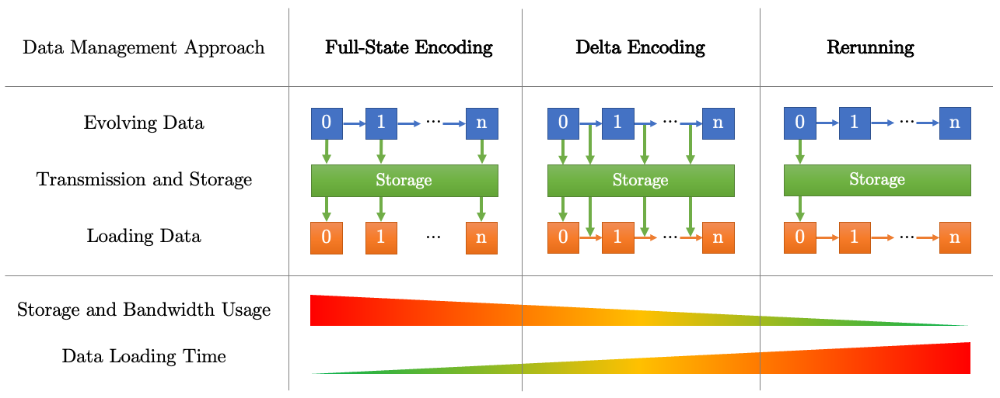

# Summary

In computational simulations, managing evolving data states efficiently is crucial. Traditional methods of storing complete snapshots at each step can be storage-intensive, while recalculating states from scratch is computationally expensive. KeepDelta addresses this challenge by providing a lightweight Python library that captures and applies only the changes (deltas) between successive states of complex, nested Python data structures. Designed for clarity and ease of use, KeepDelta produces human-readable outputs, facilitating debugging and analysis in research applications.


# Statement of need

Simulation is a widely used methodology across all Applied Science disciplines, offering a flexible, powerful, and intuitive tool for designing processes or systems and maximizing their efficiency [@SimulationExperiments]. These studies often take the form of computer experiments, where data is generated through pseudo-random sampling from known probability distributions. This approach serves as an invaluable resource for research, particularly in evaluating new methods and comparing alternative approaches [@SimulationStudies]. Computational simulations are invaluable tools for studying complex systems and their behaviors. [@ComplexSystemsSimulation]

Simulations often require mechanisms to track and store evolving states of data structures across iterations. The naive approach of saving full snapshots is storage-heavy, while recalculating states from scratch can be computationally expensive. KeepDelta introduces a middle ground by saving only the deltas (changes) between states. This approach, also known as Delta Encoding, has been successful in various similar use cases where managing evolving data states is essential like web development [@DeltaEncodingInHTTP] software version management [@NaiveDifferencesOfExecutableCode].

Human-readability is crucial for debugging and development in simulation projects, and KeepDelta is tailored specifically for this purpose. It is lightweight, supports native Python data structures, and generates results that are easy to understand. This makes it an ideal tool for Python developers and researchers seeking a simple yet powerful solution for change management. By providing clear, human-readable output, KeepDelta enhances both the development process and debugging efficiency, making it easier to track and manage changes in complex projects.




# In practice

To install the current version of the deident package, run the command:
```
pip install keepdelta
```

Then, import it into your project:
```python
import keepdelta as kd
```

`create` and `apply` are the two core functionalities of the library.

To *create* the delta between `old` and `new` variables:
```python
delta = kd.create(old, new)
```

To *apply* the delta to `old` variable to reconstruct `new` variable:
```python
new = kd.apply(old, delta)
```

`keepdelta` supports nested and mixed native Python data structures. Native Python varibales types are:
- Primitives: integer (`int`), float (`float`), string (`str`), boolean (`bool`), complex (`complex`), none (`None`)
- Collections: list (`list`), tuple (`tuple`), dictionary (`dict`), set(`set`)


# Comparison to Existing Tools

In the landscape of Python libraries designed for delta encoding, several notable tools have emerged, each with distinct features and applications.
`xdelta3` and its predecessor, `xdelta`, are tools that perform delta encoding at the binary level. These utilities are particularly effective for binary file differencing and are widely used in version control systems and data synchronization tasks. However, both are considered outdated and are no longer actively maintained. Their operation at the binary level results in outputs that are not human-readable, and they are not tailored for Python data structures, limiting their applicability in Python-centric workflows.
`detools` is a more recent addition, offering binary delta encoding capabilities within Python applications. It efficiently handles large binary files and is designed for ease of use. Nevertheless, like `xdelta3` and `xdelta`, `detools` operates at the binary level, producing non-human-readable outputs and not being specifically optimized for Python’s native data structures.
`deepdiff` is a contemporary library that facilitates the identification of differences between complex Python data structures, including dictionaries, lists, and sets. It extends support to external libraries like NumPy, enhancing its versatility. However, this integration can lead to outputs that are less human-readable compared to `keepdelta`. Additionally, `deepdiff` introduces dependencies that may not be necessary for all projects.
In contrast, `keepdelta` is a lightweight Python library optimized for simulations, focusing on efficient delta management for native Python data structures. It operates directly on Python’s native data types, producing human-readable outputs that facilitate debugging and research applications. Implemented in pure Python, `keepdelta` eliminates external dependencies, making it an ideal choice for Python-centric workflows, particularly in simulations and data analysis tasks.